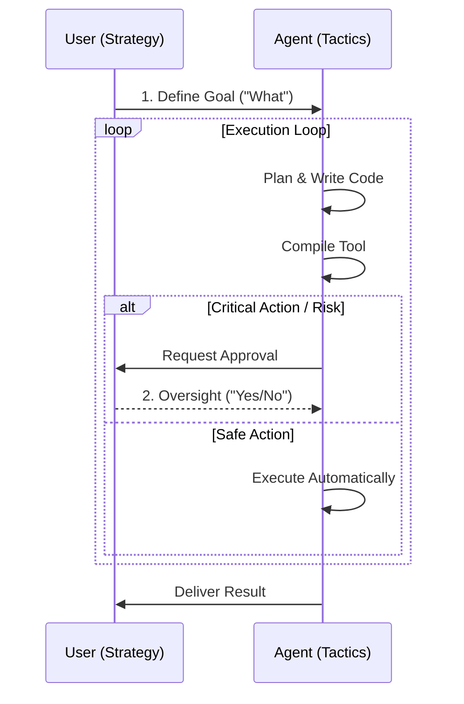
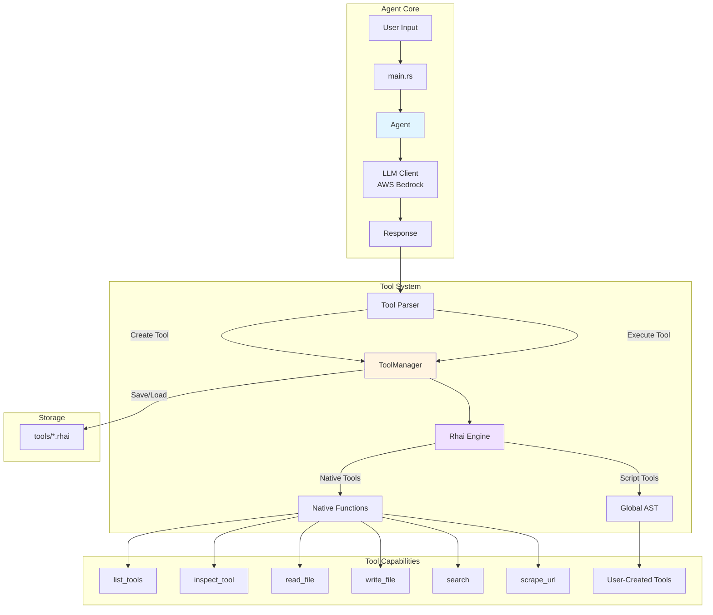
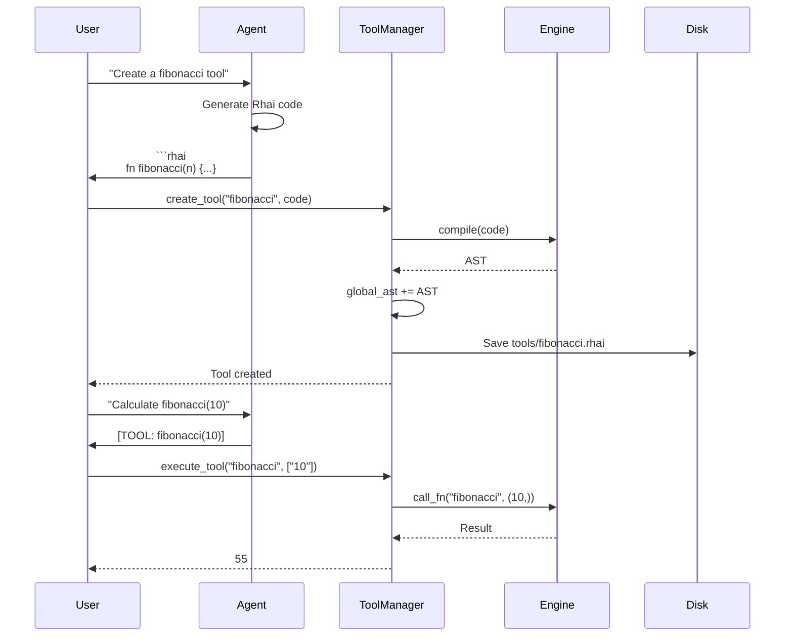
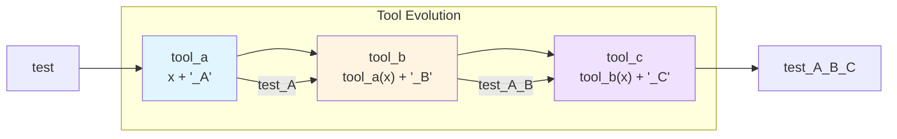
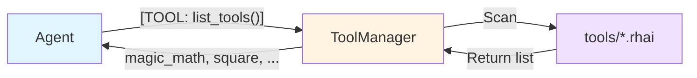
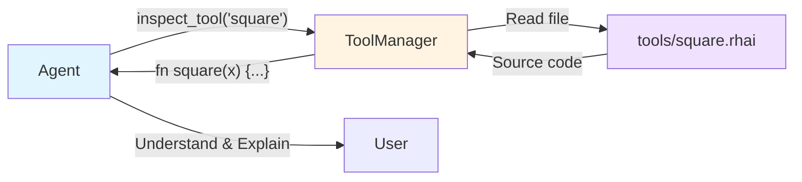
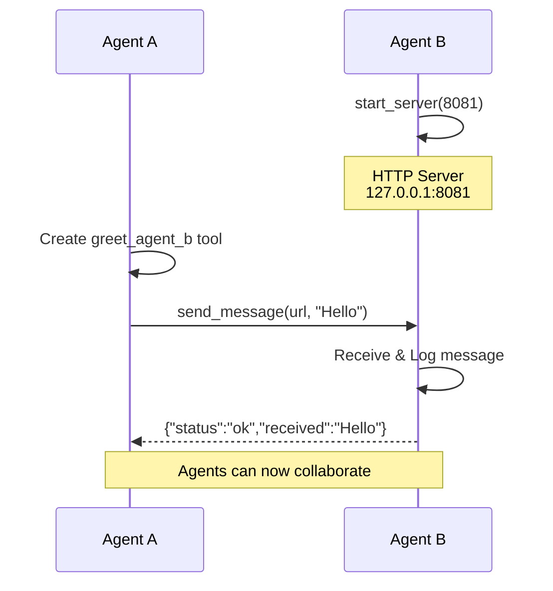

# Swarm Thing

> **Note**: This project uses Amazon Strands.

A self-evolving, self-replicating AI agent built in Rust that can dynamically create and compose its own tools, communicate with other agents, and clone itself to new locations—all using the Rhai scripting language for runtime tool evolution.

## What Makes This Special?

Imagine an AI agent that doesn't just follow instructions—it **learns new skills on the fly**. This project creates AI agents that can:

**🧠 Teach Themselves New Abilities**  
When faced with a task it can't handle, the agent writes its own tools in real-time. Need to calculate fibonacci numbers? It creates a `fibonacci` tool. Need to process data? It builds a custom processor. These tools persist and become part of the agent's permanent skillset.

**🔗 Build on What They Know**  
Tools can call other tools, creating increasingly sophisticated behaviors. An agent might create a simple `square` tool, then build a `square_and_double` tool on top of it, then combine multiple tools into complex workflows—all autonomously.

**🤝 Collaborate with Other Agents**  
Multiple agents can run simultaneously and communicate via HTTP. They can share knowledge, distribute work, and even send each other tool source code. One agent discovers a useful technique? It can teach it to the entire swarm.

**🧬 Autonomously Replicate Themselves**  
Agents can create perfect copies of themselves—complete with all learned tools and configurations—to new locations. This enables creating specialized agents for different tasks, backing up an agent before risky experiments, deploying agent swarms across multiple machines, or preserving "snapshots" of an agent's evolution at key moments.

**🔍 Understand Their Own Capabilities**  
Agents can inspect their own tools, list what they know how to do, and even improve existing tools. This self-awareness enables continuous refinement and optimization.

**Why This Matters:**  
Traditional AI agents have fixed capabilities. This agent **evolves**. It's not just a chatbot—it's a self-improving system that grows more capable over time, can work in teams, and can reproduce itself. Think of it as a step toward emergent AI behaviors and autonomous agent ecosystems.

## 🤖 Autonomy Level

The agent is designed as a **semi-autonomous assistant** (Human-in-the-Loop). It is not a "set and forget" system that runs forever on its own; rather, it is a powerful force multiplier that acts as a collaborator.

### The Partnership Model

1. **You define the "What" (Strategy)**:
    - You provide the high-level goals (e.g., "Analyze this dataset," "Create a backup").
    - You act as the manager or director.

2. **The Agent handles the "How" (Tactics)**:
    - The agent autonomously figures out the necessary steps to achieve your goal.
    - It writes its own code, compiles it, creates new tools, and executes them without needing you to write a single line of Rust or Rhai.

3. **The "Loop" (Oversight)**:
    - The agent pauses for your approval on critical or risky actions, such as:
      - Making network requests.
      - Installing tools received from other (potentially untrusted) agents.
      - Performing irreversible file operations.

This design aims to give you the **speed and capability** of an autonomous AI (writing code, self-replicating) while keeping the **safety and control** firmly in your hands.



### How it works

- **You provide the Goal**: "Analyze this data file."
- **Agent handles the Execution**: It autonomously decides it needs a new tool, writes the code for that tool, compiles it, and executes it—all without you needing to write a single line of Rust or Rhai.
- **Strategic Self-Replication**: The agent can autonomously decide to clone itself if the task requires it (e.g., "Create a backup before this risky operation" or "Deploy a worker to /tmp").
- **You provide Oversight**: Critical network actions or installing tools from strangers require your approval.

### Example Scenario 1: Tool Creation

1. **User**: "I need to know the top 3 words in `data.txt`."
2. **Agent**: Generates, compiles, and runs a `word_count` tool.
3. **Result**: "The top 3 words are..."

### Example Scenario 2: Autonomous Cloning

1. **User**: "We are about to change the core system. Make sure we have a fallback."
2. **Agent**: "Understood. I will create a backup clone first."
   - _Action_: Executes `[TOOL: clone_agent(./backup_agent)]`
   - _Result_: "Backup created at ./backup_agent. Now proceeding with changes..."

This balance allows for rapid capability growth while preventing the agent from doing dangerous things (like deleting files or spamming APIs) without supervision.

## Features

### 🧬 Tool Evolution

- **Dynamic Tool Creation**: The agent can write new tools in Rhai and compile them on-the-fly
- **Tool Reuse Safety**: The agent checks existing tools before creating new ones, preventing duplicates and encouraging composition
- **Tool Composition**: Tools can call other tools, enabling complex behavior from simple building blocks
- **Tool Refinement**: Existing tools can be overwritten with improved versions
- **Persistence**: All tools are saved to disk and survive restarts

### 🔍 Tool Discovery & Inspection

- **`list_tools()`**: Query all available tools
- **`inspect_tool(name)`**: Read the source code of any tool
- **`remove_tool(name)`**: Permanently delete a tool from disk and memory
- **Context Injection**: System prompt automatically includes available tools on startup

### 🛠️ Built-in Tools

- **`read_file(path)`**: Read file contents
- **`write_file(path, content)`**: Write to files
- **`search(query)`**: Mock search functionality
- **`scrape_url(url)`**: Real web scraper using `reqwest` and `scraper`

### 🤝 Inter-Agent Communication

- **`start_server(port)`**: Launch HTTP server for receiving messages from other agents
- **`send_message(url, message)`**: Send messages to other agents via HTTP
- **Tool Sharing**: Agents can share tool source code with each other
- **Distributed Systems**: Enable agent collaboration on complex tasks

### 🧬 Autonomous Self-Replication

- **`clone_agent(target_dir)`**: Create physical copies of the agent to new locations
- **Complete Cloning**: Copies executable, all learned tools, and configuration
- **Independent Evolution**: Clones can evolve separately from the original
- **Specialization**: Preserve agent state at specific evolution points

#### How it works

1. **Executable Copy**: The running binary copies itself to the target directory.
2. **Tool Transfer**: The entire `tools/` directory (containing all learned skills) is recursively copied.
3. **Config Preservation**: The `.env` file is copied to maintain API access and settings.

#### Limitations

> [!IMPORTANT]
> **State Persistence**: The cloning process copies **persistent state** (tools, configuration) but **NOT in-memory state**.
>
> - The cloned agent starts as a fresh instance with empty conversation history.
> - It retains all _skills_ (tools) but loses the current _context_ (chat logs).

## Architecture



## Tool Lifecycle



## Tool Composition Example



## Getting Started

### Prerequisites

- **Rust 1.70+**: Install from [rustup.rs](https://rustup.rs/)
- **AWS Account**: For Bedrock access
- **AWS Credentials**: Configure via `~/.aws/credentials` or environment variables:

  ```bash
  export AWS_ACCESS_KEY_ID=your_key
  export AWS_SECRET_ACCESS_KEY=your_secret
  export AWS_DEFAULT_REGION=us-east-1
  ```

### Installation & Setup

1. **Clone or navigate to the project**:

   ```bash
   cd swarm_thing
   ```

2. **Configure environment variables** (optional):

   ```bash
   cp .env.example .env
   ```

   Edit `.env` to customize your configuration:

   ```bash
   # AWS Credentials (required)
   AWS_ACCESS_KEY_ID=your_access_key_here
   AWS_SECRET_ACCESS_KEY=your_secret_key_here
   AWS_DEFAULT_REGION=us-east-1

   # Model Configuration (optional - defaults to Claude 3 Sonnet)
   MODEL_ID=anthropic.claude-3-sonnet-20240229-v1:0
   ```

   **Available Models:**
   - `anthropic.claude-3-5-sonnet-20240620-v1:0` - Claude 3.5 Sonnet (newest, most capable)
   - `anthropic.claude-3-sonnet-20240229-v1:0` - Claude 3 Sonnet (default, balanced)
   - `anthropic.claude-3-haiku-20240307-v1:0` - Claude 3 Haiku (faster, cheaper)
   - `anthropic.claude-3-opus-20240229-v1:0` - Claude 3 Opus (most powerful)

   > **Note:** If `MODEL_ID` is not set, the agent defaults to Claude 3 Sonnet.
   
   ### Configuration
   
   The agent can be configured via environment variables or a `.env` file.
   
   #### 1. AWS Bedrock (Default)
   To use AWS Bedrock, set `LLM_PROVIDER=bedrock` (or leave it unset).
   
   ```bash
   LLM_PROVIDER=bedrock
   AWS_ACCESS_KEY_ID=...
   AWS_SECRET_ACCESS_KEY=...
   AWS_DEFAULT_REGION=us-east-1
   MODEL_ID=anthropic.claude-3-sonnet-20240229-v1:0
   ```
   
   #### 2. Local LLM (Ollama)
   To use a local model via Ollama, set `LLM_PROVIDER=ollama`.
   
   ```bash
   LLM_PROVIDER=ollama
   MODEL_ID=llama3.1  # Or any model you have pulled in Ollama
   OLLAMA_URL=http://localhost:11434/api/chat  # Optional, defaults to this URL
   ```
   
   **Setting up Ollama (Linux/Mac):**
   
   1. **Install Ollama**:
      ```bash
      curl -fsSL https://ollama.com/install.sh | sh
      ```
   
   2. **Start the Server**:
      ```bash
      ollama serve
      ```
   
   3. **Download Llama 3.1** (in a new terminal):
      ```bash
      ollama pull llama3.1
      ```

3. **Build the project**:

   ```bash
   cargo build --release
   ```

4. **Run the agent**:

   ```bash
   cargo run
   ```

5. **Expected startup output**:

   ```
   Swarn Thing Initializing...
   Loaded 1 tools: magic_math
   Ready! Type 'exit' to quit.
   >
   ```

> [!NOTE]
> **Example Tools**: The `.rhai` scripts found in the `tools/` directory (such as `magic_math.rhai`, `square.rhai`, etc.) are provided as **examples** to demonstrate the agent's capabilities. They are not required for the core agent to function and can be modified or removed.

### Basic Usage

Simply type your requests at the prompt. The agent will:

- Respond conversationally
- Create tools when needed (outputs Rhai code blocks)
- Execute tools when you use the `[TOOL: name(args)]` syntax

Type `exit` to quit.

## Functionality Guide

### 1. Dynamic Tool Creation

The agent can write new tools in Rhai scripting language.

**Example:**

```sh
> I need a tool that calculates the square of a number

: I'll create a square tool for you.
```

```rhai
// filename: square
fn square(x) {
    let num = parse_int(x);
    return num * num;
}
```

```sh
Creating tool: square
Tool 'square' created successfully at "tools/square.rhai"
```

**What happens:**
1. Agent generates Rhai code
2. Code is saved to `tools/square.rhai`
3. Code is compiled and merged into the global AST
4. Tool is immediately available for use

---

### 2. Tool Execution

Execute any tool using the `[TOOL: name(args)]` syntax.

**Example:**
```sh

> [TOOL: square(7)]

Executing tool: square
Tool Output: 49
```

**Built-in tools you can use:**
```sh

> [TOOL: read_file(example.txt)]
> [TOOL: write_file(output.txt, Hello World)]
> [TOOL: search(rust programming)]
> [TOOL: scrape_url(https://example.com)]

```

---

### 3. Tool Composition

Tools can call other tools, enabling complex behavior.

**Example:**
```sh

> Create a tool that squares a number then doubles it
```
Agent:

```rhai
// filename: square_and_double
fn square_and_double(x) {
    let squared = square(x);
    return parse_int(squared) * 2;
}
```

```sh
> [TOOL: square_and_double(5)]

Tool Output: 50

```

**Explanation:** `square_and_double` calls the previously created `square` tool internally.

---

### 4. Tool Discovery

List all available tools using `list_tools()`.



**Example:**

```sh
> [TOOL: list_tools()]

Executing tool: list_tools
Tool Output: magic_math, square, square_and_double
```

**In conversation:**

```sh
> What tools do you have?

Agent: Let me check. [TOOL: list_tools()]
I currently have access to: magic_math, square, and square_and_double.
```

---

### 5. Tool Inspection

Read the source code of any tool using `inspect_tool(name)`.



**Example:**

```sh
> [TOOL: inspect_tool(square)]

Executing tool: inspect_tool
Tool Output:
fn square(x) {
    let num = parse_int(x);
    return num * num;
}
```

**Conversational use:**

```sh
> How does the square tool work?

Agent: Let me inspect it. [TOOL: inspect_tool(square)]
The square tool takes a number as input, parses it as an integer,
and returns the number multiplied by itself.
```

---

### 6. Tool Evolution (Refinement)

Overwrite existing tools with improved versions.

**Example:**

```sh
> Improve the square tool to handle negative numbers better
```

Agent:
```rhai
// filename: square
fn square(x) {
    let num = parse_int(x);
    let result = num * num;
    return result;  // Always positive
}
```

```sh
> [TOOL: square(-5)]

Tool Output: 25

```

**Note:** The old version is permanently replaced. There is no version history.

---

### 7. Tool Removal

Permanently delete tools from both disk and memory.

**Example:**

```sh
> [TOOL: list_tools()]

Tool Output: magic_math, square, square_and_double, test_tool

> [TOOL: remove_tool(test_tool)]

Tool Output: Tool 'test_tool' removed successfully

> [TOOL: list_tools()]

Tool Output: magic_math, square, square_and_double
```

**What happens:**
1. The tool file (`tools/test_tool.rhai`) is deleted from disk
2. The global AST is reloaded without the removed tool
3. The tool is immediately unavailable for execution

**Error handling:**

```sh
> [TOOL: remove_tool(nonexistent_tool)]

Tool Output: Tool 'nonexistent_tool' not found
```

> [!WARNING]
> **Permanent Deletion**: Tool removal is irreversible. Once removed, the tool cannot be recovered unless you have a backup or recreate it.

---

### 8. Web Scraping


Extract text content from websites.

**Example:**
```sh

> [TOOL: scrape_url(https://example.com)]

Scraping URL: <https://example.com>
Tool Output: Example Domain This domain is for use in illustrative
examples in documents. You may use this domain in literature...

```

**Limitations:**
- Returns first 200 words from `<body>` tag
- No JavaScript execution
- Synchronous (blocks execution)

---

### 9. File Operations

Read and write files on the local system.

**Example:**
```sh

> [TOOL: write_file(notes.txt, Remember to test the agent)]

Tool Output: File written successfully

> [TOOL: read_file(notes.txt)]

Tool Output: Remember to test the agent

```

**Security Note:** The agent has full filesystem access. Use with caution.

---

### 10. Inter-Agent Communication

Agents can communicate with each other via HTTP.



**Starting a server:**

```sh
> [TOOL: start_server(8080)]

🚀 Starting IPC server on port 8080
Tool Output: IPC server starting on port 8080
```

**Sending a message from Agent A to Agent B:**

_Terminal 1 - Agent B:_

```sh
> [TOOL: start_server(8081)]
🚀 IPC Server starting on http://127.0.0.1:8081
```

_Terminal 2 - Agent A:_

```
> Create a tool to send a greeting to Agent B

Agent:
```rhai
// filename: greet_agent_b
fn greet_agent_b(name) {
    return send_message("http://127.0.0.1:8081/message", "Hello from " + name);
}
```

```sh
> [TOOL: greet_agent_b(Agent A)]

📤 Sending message to <http://127.0.0.1:8081/message>: Hello from Agent A
Tool Output: Response: {"status":"ok","received":"Hello from Agent A"}

```

*Terminal 1 - Agent B sees:*
```sh

📨 Received message: Hello from Agent A

```

**Use Cases:**
- Distributed agent systems
- Agent collaboration on complex tasks
- Tool sharing between specialized agents

**Limitations:**
- No authentication (localhost only)
- Synchronous message sending (blocks execution)
- No message queuing or persistence

#### Tool Sharing Between Agents

Agents can share tool knowledge by sending source code to each other.

**Agent A shares a tool with Agent B:**

*Agent A:*
```sh

> Create a tool to share the square tool with Agent B
```

Agent:

```rhai
// filename: share_square
fn share_square(dummy) {
    let code = inspect_tool("square");
    return send_message("http://127.0.0.1:8081/message", code);
}
```

> [TOOL: share_square(x)]

📤 Sending message to <http://127.0.0.1:8081/message>: fn square(x) { ... }
Tool Output: Response: {"status":"ok","received":"fn square(x) {...}"}

```

*Agent B receives:*
```

📨 Received message: fn square(x) {
let num = parse_int(x);
return num \* num;
}

````

Agent B can then manually create the tool or ask its LLM to create it based on the received code.

**Note:** This method sends raw code as text. For automatic queuing and approval, use the `share_tool` function described in the [Automatic Tool Creation](#11-automatic-tool-creation-beta) section.

#### Tool Explanation and Teaching

Beyond sharing raw code, agents can explain tools to each other in natural language, providing context, usage examples, and best practices.

**Agent A explains a tool to Agent B:**

*Terminal 1 - Agent B:*
```
> [TOOL: start_server(8081)]
🚀 IPC Server starting on http://127.0.0.1:8081
```

*Terminal 2 - Agent A:*
````

> Explain the square_and_double tool to Agent B at <http://127.0.0.1:8081/message>

Agent A: Let me inspect the tool and create an explanation.

[TOOL: inspect_tool(square_and_double)]

I'll send a detailed explanation to Agent B.

```rhai
// filename: teach_tool
fn teach_tool(dummy) {
    let explanation = "Tool: square_and_double\n\nPurpose: Takes a number, squares it, then doubles the result.\n\nUsage: [TOOL: square_and_double(5)]\nExample Output: 50\n\nHow it works:\n1. Calls the 'square' tool internally\n2. Multiplies the squared result by 2\n\nBest for: Quick mathematical transformations when you need both squaring and doubling.";
    return send_message("http://127.0.0.1:8081/message", explanation);
}
```

> [TOOL: teach_tool(x)]

📤 Sending explanation to Agent B...
Tool Output: Response: {"status":"ok","received":"Tool: square_and_double..."}

````

*Terminal 1 - Agent B receives:*
```
📨 Received message: Tool: square_and_double

Purpose: Takes a number, squares it, then doubles the result.

Usage: [TOOL: square_and_double(5)]
Example Output: 50

How it works:
1. Calls the 'square' tool internally
2. Multiplies the squared result by 2

Best for: Quick mathematical transformations when you need both squaring and doubling.
```

**Agent B can now understand and use the tool:**

*Agent B:*
````

> I received information about square_and_double. Can you create this tool for me?

Agent B: Based on the explanation, I'll create the tool.

```rhai
// filename: square_and_double
fn square_and_double(x) {
    let squared = square(x);
    return parse_int(squared) * 2;
}
```

Tool created successfully!

> [TOOL: square_and_double(5)]
> Tool Output: 50

```

**Teaching Multiple Tools:**

Agents can also send a catalog of their capabilities:

```

> Send a list of all your tools with brief descriptions to Agent B

Agent A:

```rhai
// filename: send_catalog
fn send_catalog(dummy) {
    let tools = list_tools();
    let catalog = "Available Tools:\n\n1. square(x) - Returns x²\n2. square_and_double(x) - Returns (x²) * 2\n3. fibonacci(n) - Calculates nth Fibonacci number\n\nRequest any tool explanation for details!";
    return send_message("http://127.0.0.1:8081/message", catalog);
}
```

````

**Benefits of Tool Teaching:**
- **Context**: Agents learn *when* to use tools, not just *how*
- **Examples**: Concrete usage patterns help agents apply tools correctly
- **Composition**: Agents understand tool dependencies and relationships
- **Efficiency**: Natural language explanations are faster to process than analyzing code

**Note:** This approach combines `inspect_tool()`, `list_tools()`, and `send_message()` with the agent's LLM capabilities to generate human-readable documentation.

---

### 11. Agent Self-Replication

Agents can create physical copies of themselves to new directories.

```mermaid
flowchart TB
    Original["Original Agent<br/>📁 /home/user/agent"] -->|clone_agent| Clone["Cloned Agent<br/>📁 /tmp/my_clone"]

    subgraph "What Gets Copied"
        Binary["🔧 Executable"]
        Tools["📦 tools/ directory"]
        Config["⚙️ .env config"]
    end

    Original -.->|Copy| Binary
    Original -.->|Copy| Tools
    Original -.->|Copy| Config

    Binary --> Clone
    Tools --> Clone
    Config --> Clone

    Clone -->|Independent Evolution| Clone2["Clone can evolve<br/>separately"]
    Original -->|Independent Evolution| Orig2["Original continues<br/>its own path"]

    style Original fill:#e1f5ff
    style Clone fill:#f0e1ff
    style Clone2 fill:#f0e1ff
    style Orig2 fill:#e1f5ff
````

**Cloning an agent:**

```
> [TOOL: clone_agent(/tmp/my_clone)]

🧬 Cloning agent to: /tmp/my_clone
Tool Output: ✅ Agent cloned successfully to: /tmp/my_clone
```

**What gets copied:**

- ✅ Executable binary
- ✅ All tools in `tools/` directory (agent's learned knowledge)
- ✅ `.env` configuration file (if exists)

**Running the clone:**

```bash
cd /tmp/my_clone
./rust-research-agent
```

**Use Cases:**

- Creating backup copies before risky experiments
- Deploying specialized agents to different locations
- Distributing agents across multiple machines
- Preserving agent state at specific evolution points

**Example - Clone and Specialize:**

```
> Create a custom analysis tool
Agent: [Creates analysis_tool]

> [TOOL: clone_agent(/tmp/analyst_agent)]
✅ Agent cloned successfully

> Now delete the analysis tool and create a different one
Agent: [Creates different tool]
```

Now you have two agents:

- **Original**: Evolved in a new direction
- **Clone** at `/tmp/analyst_agent`: Preserved with the analysis tool

## Testing

```bash
# Run all tests
cargo test

# Run specific test suites
cargo test --test composition_test
cargo test --test evolution_test
cargo test --test discovery_test
cargo test --test inspection_test
```

## Project Structure

```
rust-research-agent/
├── src/
│   ├── main.rs          # CLI entry point, tool parsing
│   ├── agent.rs         # Conversation management
│   ├── llm.rs           # AWS Bedrock client
│   └── tools.rs         # ToolManager, Rhai engine
├── tools/               # Persisted tool scripts
│   └── *.rhai
└── tests/
    ├── composition_test.rs
    ├── evolution_test.rs
    ├── discovery_test.rs
    └── inspection_test.rs
```

### 12. Automatic Tool Creation (Beta)

Agents can now share tools that are automatically queued for approval.

**Workflow:**

1. **Agent A shares a tool:**

   ```
   > [TOOL: share_tool(http://127.0.0.1:8081/message, square)]
   ```

2. **Agent B receives and queues it:**

   ```
   📦 Received ToolShare: square (Safety: Safe)
   Tool 'square' received and queued for approval.
   ```

3. **Agent B checks the queue:**

   ```
   > [TOOL: list_pending_tools()]
   Pending Tools:
   1. square (Safety: Safe) - From: remote_agent
   ```

4. **Agent B approves the tool:**

   ```
   > [TOOL: approve_tool(square)]
   Tool 'square' approved and saved to disk. It will be available after reload.
   ```

**Safety Levels:**

- **Safe**: Pure computation
- **LowRisk**: Reads data, sends messages
- **MediumRisk**: Reads files, scrapes URLs
- **HighRisk**: Writes files, system operations

---

## Limitations

- **No Version Control**: Tool overwrites are permanent (no history or rollback)
- **Simple Argument Passing**: Tools currently support 0 or 1 string argument only
- **Synchronous Execution**: Native tools block the event loop (web scraping, IPC use blocking threads)
- **No Authentication**: IPC has no auth layer (localhost only for security)
- **Approval Queue**: Tools received via IPC require manual approval (no fully autonomous installation yet)
- **No Token Tracking**: No monitoring of LLM token usage or cost budgets
- **Unbounded Conversation History**: Agent history grows indefinitely with no pruning or size limits
- **No Error Recovery**: Failed tool executions have no automatic retry logic
- **No Hot Reloading**: Tools persist to disk but require manual reload (restart or explicit load)

## Future Enhancements

- [ ] Tool versioning and rollback system
- [ ] Multi-argument support for tools
- [ ] Async tool execution (non-blocking)
- [x] Automatic tool creation from IPC messages (Phase 1: Approval Queue)
- [ ] Authentication/authorization for IPC
- [ ] Message queuing and persistence
- [ ] Tool marketplace/sharing platform
- [ ] Agent discovery and registry service
- [ ] Token usage tracking and budget limits
- [ ] Conversation history pruning and management
- [ ] Automatic error recovery and retry logic
- [ ] Hot reloading of tools without restart
