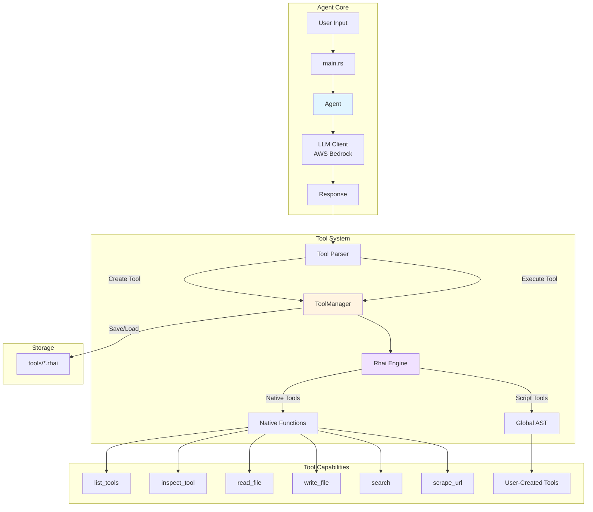
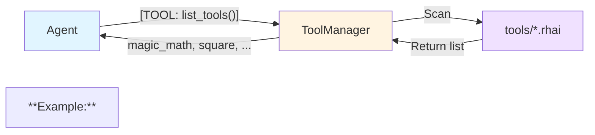
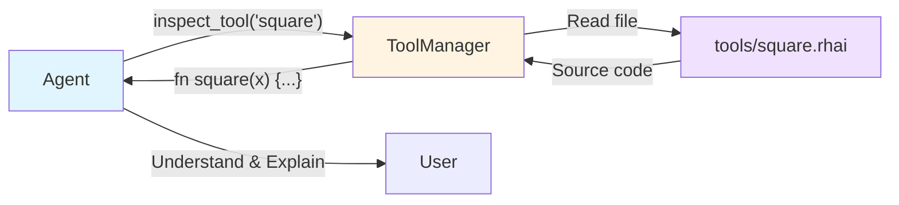

# Rust Swarm Thing

A self-evolving AI agent built in Rust that can dynamically create, compose, and inspect its own tools using the Rhai scripting language.

## Features

### 🧬 Tool Evolution

- **Dynamic Tool Creation**: The agent can write new tools in Rhai and compile them on-the-fly
- **Tool Composition**: Tools can call other tools, enabling complex behavior from simple building blocks
- **Tool Refinement**: Existing tools can be overwritten with improved versions
- **Persistence**: All tools are saved to disk and survive restarts

### 🔍 Tool Discovery & Inspection

- **`list_tools()`**: Query all available tools
- **`inspect_tool(name)`**: Read the source code of any tool
- **Context Injection**: System prompt automatically includes available tools on startup

### 🛠️ Built-in Tools

- **`read_file(path)`**: Read file contents
- **`write_file(path, content)`**: Write to files
- **`search(query)`**: Mock search functionality
- **`scrape_url(url)`**: Real web scraper using `reqwest` and `scraper`

## Architecture



## Tool Lifecycle

````mermaid
sequenceDiagram
    participant User
    participant Agent
    participant ToolManager
    participant Engine
    participant Disk

    User->>Agent: "Create a fibonacci tool"
    Agent->>Agent: Generate Rhai code
    Agent->>User: ```rhai<br/>fn fibonacci(n) {...}
    User->>ToolManager: create_tool("fibonacci", code)
    ToolManager->>Engine: compile(code)
    Engine-->>ToolManager: AST
    ToolManager->>ToolManager: global_ast += AST
    ToolManager->>Disk: Save tools/fibonacci.rhai
    ToolManager-->>User: Tool created

    User->>Agent: "Calculate fibonacci(10)"
    Agent->>User: [TOOL: fibonacci(10)]
    User->>ToolManager: execute_tool("fibonacci", ["10"])
    ToolManager->>Engine: call_fn("fibonacci", (10,))
    Engine-->>ToolManager: Result
    ToolManager-->>User: 55
````

## Tool Composition Example

```mermaid
graph LR
    subgraph "Tool Evolution"
        A[tool_a<br/>x + "_A"] --> B[tool_b<br/>tool_a(x) + "_B"]
        B --> C[tool_c<br/>tool_b(x) + "_C"]
    end

    Input["test"] --> A
    A --> |"test_A"| B
    B --> |"test_A_B"| C
    C --> Output["test_A_B_C"]

    style A fill:#e1f5ff
    style B fill:#fff4e1
    style C fill:#f0e1ff
```

## Getting Started

### Prerequisites

- **Rust 1.70+**: Install from [rustup.rs](https://rustup.rs/)
- **AWS Account**: For Bedrock access
- **AWS Credentials**: Configure via `~/.aws/credentials` or environment variables:

  ```bash
  export AWS_ACCESS_KEY_ID=your_key
  export AWS_SECRET_ACCESS_KEY=your_secret
  export AWS_DEFAULT_REGION=us-east-1
  ```

### Installation & Setup

1. **Clone or navigate to the project**:

   ```bash
   cd rust-research-agent
   ```

2. **Build the project**:

   ```bash
   cargo build --release
   ```

3. **Run the agent**:

   ```bash
   cargo run
   ```

4. **Expected startup output**:

   ```
   Rust Swarn Thing Initializing...
   Loaded 1 tools: magic_math
   Ready! Type 'exit' to quit.
   >
   ```

### Basic Usage

Simply type your requests at the prompt. The agent will:

- Respond conversationally
- Create tools when needed (outputs Rhai code blocks)
- Execute tools when you use the `[TOOL: name(args)]` syntax

Type `exit` to quit.

## Functionality Guide

### 1. Dynamic Tool Creation

The agent can write new tools in Rhai scripting language.

**Example:**

````
> I need a tool that calculates the square of a number

Agent: I'll create a square tool for you.
```rhai
// filename: square
fn square(x) {
    let num = parse_int(x);
    return num * num;
}
````

Creating tool: square
Tool 'square' created successfully at "tools/square.rhai"

```

**What happens:**
1. Agent generates Rhai code
2. Code is saved to `tools/square.rhai`
3. Code is compiled and merged into the global AST
4. Tool is immediately available for use

---

### 2. Tool Execution

Execute any tool using the `[TOOL: name(args)]` syntax.

**Example:**
```

> [TOOL: square(7)]

Executing tool: square
Tool Output: 49

```

**Built-in tools you can use:**
```

> [TOOL: read_file(example.txt)]
> [TOOL: write_file(output.txt, Hello World)]
> [TOOL: search(rust programming)]
> [TOOL: scrape_url(https://example.com)]

```

---

### 3. Tool Composition

Tools can call other tools, enabling complex behavior.

**Example:**
```

> Create a tool that squares a number then doubles it

Agent:

```rhai
// filename: square_and_double
fn square_and_double(x) {
    let squared = square(x);
    return parse_int(squared) * 2;
}
```

> [TOOL: square_and_double(5)]

Tool Output: 50

````

**Explanation:** `square_and_double` calls the previously created `square` tool internally.

---

### 4. Tool Discovery

List all available tools using `list_tools()`.


> [TOOL: list_tools()]

Executing tool: list_tools
Tool Output: magic_math, square, square_and_double
```

**In conversation:**

```
> What tools do you have?

Agent: Let me check. [TOOL: list_tools()]
I currently have access to: magic_math, square, and square_and_double.
```

---

### 5. Tool Inspection

Read the source code of any tool using `inspect_tool(name)`.



**Example:**

```
> [TOOL: inspect_tool(square)]

Executing tool: inspect_tool
Tool Output:
fn square(x) {
    let num = parse_int(x);
    return num * num;
}
```

**Conversational use:**

```
> How does the square tool work?

Agent: Let me inspect it. [TOOL: inspect_tool(square)]
The square tool takes a number as input, parses it as an integer,
and returns the number multiplied by itself.
```

---

### 6. Tool Evolution (Refinement)

Overwrite existing tools with improved versions.

**Example:**

````
> Improve the square tool to handle negative numbers better

Agent:
```rhai
// filename: square
fn square(x) {
    let num = parse_int(x);
    let result = num * num;
    return result;  // Always positive
}
````

> [TOOL: square(-5)]

Tool Output: 25

```

**Note:** The old version is permanently replaced. There is no version history.

---

### 7. Web Scraping

Extract text content from websites.

**Example:**
```

> [TOOL: scrape_url(https://example.com)]

Scraping URL: <https://example.com>
Tool Output: Example Domain This domain is for use in illustrative
examples in documents. You may use this domain in literature...

```

**Limitations:**
- Returns first 200 words from `<body>` tag
- No JavaScript execution
- Synchronous (blocks execution)

---

### 8. File Operations

Read and write files on the local system.

**Example:**
```

> [TOOL: write_file(notes.txt, Remember to test the agent)]

Tool Output: File written successfully

> [TOOL: read_file(notes.txt)]

Tool Output: Remember to test the agent

````

**Security Note:** The agent has full filesystem access. Use with caution.

---

### 9. Inter-Agent Communication

Agents can communicate with each other via HTTP.

```mermaid
sequenceDiagram
    participant A as Agent A
    participant B as Agent B

    B->>B: start_server(8081)
    Note over B: HTTP Server<br/>127.0.0.1:8081

    A->>A: Create greet_agent_b tool
    A->>B: send_message(url, "Hello")
    B->>B: Receive & Log message
    B-->>A: {"status":"ok","received":"Hello"}

    Note over A,B: Agents can now collaborate
````

**Starting a server:**

```
> [TOOL: start_server(8080)]

🚀 Starting IPC server on port 8080
Tool Output: IPC server starting on port 8080
```

**Sending a message from Agent A to Agent B:**

_Terminal 1 - Agent B:_

```
> [TOOL: start_server(8081)]
🚀 IPC Server starting on http://127.0.0.1:8081
```

_Terminal 2 - Agent A:_

````
> Create a tool to send a greeting to Agent B

Agent:
```rhai
// filename: greet_agent_b
fn greet_agent_b(name) {
    return send_message("http://127.0.0.1:8081/message", "Hello from " + name);
}
````

> [TOOL: greet_agent_b(Agent A)]

📤 Sending message to <http://127.0.0.1:8081/message>: Hello from Agent A
Tool Output: Response: {"status":"ok","received":"Hello from Agent A"}

```

*Terminal 1 - Agent B sees:*
```

📨 Received message: Hello from Agent A

```

**Use Cases:**
- Distributed agent systems
- Agent collaboration on complex tasks
- Tool sharing between specialized agents

**Limitations:**
- No authentication (localhost only)
- Synchronous message sending (blocks execution)
- No message queuing or persistence

#### Tool Sharing Between Agents

Agents can share tool knowledge by sending source code to each other.

**Agent A shares a tool with Agent B:**

*Agent A:*
```

> Create a tool to share the square tool with Agent B

Agent:

```rhai
// filename: share_square
fn share_square(dummy) {
    let code = inspect_tool("square");
    return send_message("http://127.0.0.1:8081/message", code);
}
```

> [TOOL: share_square(x)]

📤 Sending message to <http://127.0.0.1:8081/message>: fn square(x) { ... }
Tool Output: Response: {"status":"ok","received":"fn square(x) {...}"}

```

*Agent B receives:*
```

📨 Received message: fn square(x) {
let num = parse_int(x);
return num \* num;
}

````

Agent B can then manually create the tool or ask its LLM to create it based on the received code.

**Note:** Automatic tool creation from IPC messages is not yet implemented. Agent B must manually process the received code.

---

### 10. Agent Self-Replication

Agents can create physical copies of themselves to new directories.

```mermaid
flowchart TB
    Original["Original Agent<br/>📁 /home/user/agent"] -->|clone_agent| Clone["Cloned Agent<br/>📁 /tmp/my_clone"]

    subgraph "What Gets Copied"
        Binary["🔧 Executable"]
        Tools["📦 tools/ directory"]
        Config["⚙️ .env config"]
    end

    Original -.->|Copy| Binary
    Original -.->|Copy| Tools
    Original -.->|Copy| Config

    Binary --> Clone
    Tools --> Clone
    Config --> Clone

    Clone -->|Independent Evolution| Clone2["Clone can evolve<br/>separately"]
    Original -->|Independent Evolution| Orig2["Original continues<br/>its own path"]

    style Original fill:#e1f5ff
    style Clone fill:#f0e1ff
    style Clone2 fill:#f0e1ff
    style Orig2 fill:#e1f5ff
````

**Cloning an agent:**

```
> [TOOL: clone_agent(/tmp/my_clone)]

🧬 Cloning agent to: /tmp/my_clone
Tool Output: ✅ Agent cloned successfully to: /tmp/my_clone
```

**What gets copied:**

- ✅ Executable binary
- ✅ All tools in `tools/` directory (agent's learned knowledge)
- ✅ `.env` configuration file (if exists)

**Running the clone:**

```bash
cd /tmp/my_clone
./rust-research-agent
```

**Use Cases:**

- Creating backup copies before risky experiments
- Deploying specialized agents to different locations
- Distributing agents across multiple machines
- Preserving agent state at specific evolution points

**Example - Clone and Specialize:**

```
> Create a custom analysis tool
Agent: [Creates analysis_tool]

> [TOOL: clone_agent(/tmp/analyst_agent)]
✅ Agent cloned successfully

> Now delete the analysis tool and create a different one
Agent: [Creates different tool]
```

Now you have two agents:

- **Original**: Evolved in a new direction
- **Clone** at `/tmp/analyst_agent`: Preserved with the analysis tool

## Testing

```bash
# Run all tests
cargo test

# Run specific test suites
cargo test --test composition_test
cargo test --test evolution_test
cargo test --test discovery_test
cargo test --test inspection_test
```

## Project Structure

```
rust-research-agent/
├── src/
│   ├── main.rs          # CLI entry point, tool parsing
│   ├── agent.rs         # Conversation management
│   ├── llm.rs           # AWS Bedrock client
│   └── tools.rs         # ToolManager, Rhai engine
├── tools/               # Persisted tool scripts
│   └── *.rhai
└── tests/
    ├── composition_test.rs
    ├── evolution_test.rs
    ├── discovery_test.rs
    └── inspection_test.rs
```

## Limitations

- **No Version Control**: Tool overwrites are permanent (no history)
- **Simple Argument Passing**: Tools currently support 0 or 1 string argument
- **Synchronous Execution**: Native tools block the event loop
- **No Authentication**: IPC has no auth layer (localhost only for security)
- **Manual Tool Sharing**: Agent B must manually process received tool code (no automatic creation)

## Future Enhancements

- [ ] Tool versioning and rollback system
- [ ] Multi-argument support for tools
- [ ] Async tool execution (non-blocking)
- [ ] Automatic tool creation from IPC messages
- [ ] Authentication/authorization for IPC
- [ ] Message queuing and persistence
- [ ] Tool marketplace/sharing platform
- [ ] Agent discovery and registry service
